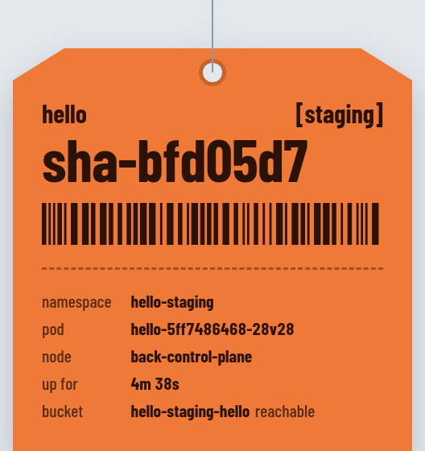
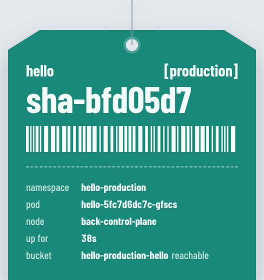

<a href="https://github.com/hvpaiva/back"></a>

# hello

The sample service of the [BACK lab](https://github.com/hvpaiva/back). It's a status page that shows which version is running, in which stage, on which pod, and whether it reaches the bucket the platform gave it.

<p align="center">
  
  
</p>

The page is styled as a hang tag: orange in staging, green in production, grey when it runs outside the cluster. The big line is the version, and the barcode is drawn from it, so a new version looks different at a glance. When a new version starts answering, the page reloads by itself. You can watch a rollout without touching the browser.

## How it ships

This repository holds the code and the service's deploy configuration, in `charts/hello/`. The chart that reads it belongs to the platform ([`charts/app`](https://github.com/hvpaiva/back/tree/main/charts/app) in the lab repository), so the service only says what it needs: its name, team, port, size, whether it's public, and a bucket (with versioning in production). The platform creates the bucket and hands hello its details.

Each stage is a branch:

| Branch | Stage | Address |
|---|---|---|
| `staging` | staging | http://hello.staging.localhost |
| `main` | production | http://hello.localhost |

The CI in `.github/workflows/ci.yaml` is two calls to workflows the platform provides in the lab repository: [`go.yaml`](https://github.com/hvpaiva/back/blob/main/.github/workflows/go.yaml) checks formatting, runs `go vet` and the tests, and [`delivery.yaml`](https://github.com/hvpaiva/back/blob/main/.github/workflows/delivery.yaml) does the rest, the same for every service. On a pull request it checks `charts/hello/` against the platform's chart, so a mistake shows up before the merge. On the stage branches it ships:

1. A push to `staging` runs the tests, builds `ghcr.io/hvpaiva/back-hello:sha-<commit>` and commits that image to `charts/hello/values-staging.yaml`.
2. A pull request from `staging` to `main` is the promotion. Once it's merged, CI copies the image staging was running into `charts/hello/values-production.yaml`. Nothing is rebuilt.
3. Argo CD, in the lab cluster, notices each commit and rolls it out. CI never talks to the cluster.

A push that only changes `charts/` or the documentation builds nothing: Argo CD applies the new configuration as it is. That's also how rolling back works: revert the commit that changed the image, on `main` for production or on `staging` for staging.

## Run it locally

```sh
mise install          # Go and just, pinned in mise.toml
just run              # http://localhost:8080, as the grey "local" tag
just run staging      # preview the staging tag (or production)
just test
```

## Interface

| | |
|---|---|
| `GET /` | The status page |
| `GET /api/info` | The same facts as JSON |
| `GET /healthz` | `ok`, for the liveness and readiness probes |

It listens on `PORT` (8080 by default) and reads `APP_ENV`, plus `POD_NAME`, `POD_NAMESPACE` and `NODE_NAME`, which the platform's chart fills in from the Kubernetes downward API. When `BUCKET_NAME` is set, it checks that bucket on every request with the AWS SDK, which reads `AWS_REGION`, `AWS_ENDPOINT_URL` and the credentials from the environment; the platform provides all of them.

The font is Barlow Condensed, under the SIL Open Font License (`web/fonts/OFL.txt`).
